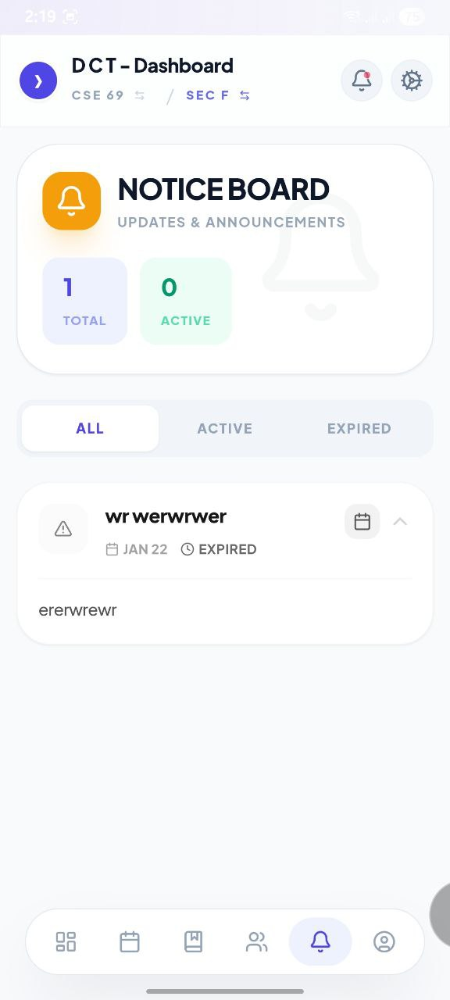
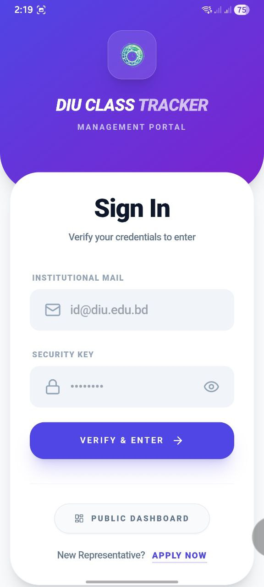
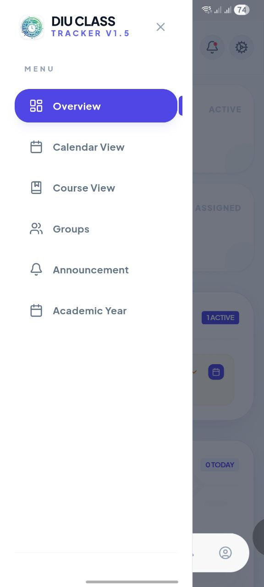

# 🎓 DIU CSE Academic Tracker (Android App)

**DIU CSE Academic Tracker** is a smart Android application built for students of the **Computer Science & Engineering (CSE) Department, Daffodil International University**.  
It helps students stay organized by providing quick access to class routines, notices, and academic information—all in one place.

---

## ✨ Highlights
- Designed specifically for **DIU CSE students**
- Clean, lightweight, and student-friendly UI
- Works even with limited internet access
- Saves time and reduces missed classes or notices

---

## 📱 Key Features

- **📊 Smart Class Activity**  
  Automatically highlights your **current and next class** based on time.

- **📢 Notice Board**  
  Receive department and teacher notices in real time.

- **📅 Academic Calendar**  
  View exam dates, holidays, and important academic events.

- **👨‍🏫 Faculty Information**  
  Quick access to faculty details (if available).

- **📴 Offline Access**  
  Previously synced routines remain accessible without internet.

- **🔐 Secure Login System**  
  Role-based access for **Students**, **CRs**, and **Faculty**.

---

## 📥 Installation Guide (APK)

You can install the app manually using the APK file.

### Step 1: Download
Download the latest **`DIU-CLASS-TRACKER.apk`** from the  
👉 **GitHub Releases** section of this repository.

### Step 2: Allow Unknown Sources
- Go to **Settings → Security**
- Enable **Install unknown apps** for your browser or file manager

### Step 3: Install
- Open the downloaded APK
- Tap **Install**
- Launch the app after installation 🎉

> ⚠️ Google Play Protect may show a warning because the app is not installed from Play Store.  
> This app is safe and open-source.

---

## 📖 How to Use

1. **Login** using your credentials
2. **Select Batch & Section** (for students)
3. View **Current Class**, **Next Class**, and **Recent Notices** on the dashboard
4. Open the **Routine** tab for weekly schedule
5. Use the **Notices** tab to view all announcements

---

## 📸 Screenshots

| Dashboard | Calendar | Notice Board | Settings | CR Login | Side Navigation |
|:--:|:--:|:--:|:--:|:--:|:--:|
|  |  |  |  |  |  |

> 📌 Make sure all images are placed inside a folder named `screenshots/`

---

## 🛠️ Technology Stack
- Android (Java / Kotlin)
- Android Studio
- Gradle

---

## ⚠️ Disclaimer
This application is **not an official DIU product**.  
It is an **independent student-developed project** created for educational and academic management purposes.

---

## 📄 License

This project is licensed under the **MIT License**.

You are free to use, modify, and distribute this software under the license terms.

---

## 👨‍💻 Developer

**Naim Hossain**  
🇧🇩 Bangladesh  

---

  Made with ❤️ for DIU students

